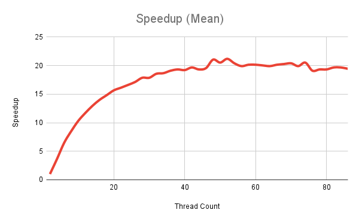
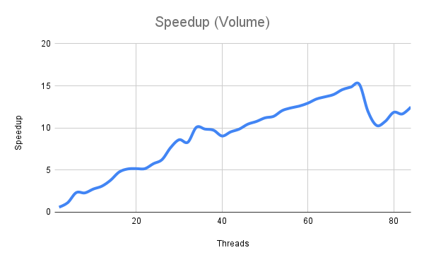

# Accelerating Computation with Multi-Threading

This project is a hands-on exploration of speeding up programs by using multiple CPU cores. Two basic applications (computing a mean and computing a volume) are implemented in both serial and multi-threaded versions. The goal is to compare performance and show how “throwing more hardware at it” can dramatically improve computation times when workloads are parallelizable.

---

## Speedup Analysis

To evaluate the performance gains from multi-threading, we calculate the speedup achieved at each thread count using the formula:

### $\text{speedup} = \frac{\text{single-thread running time}}{\text{multi-threaded running time}}$

---

## Computing a Mean

Does the graph converge to some general value? 
What is the maximum speedup we got from theading? 
What happens when we use more cores than are available in the hardware?
Consider the number of cores in the system, do we get a linear scaling of performance as you add more cores?

### Shape of the curve

-	The speedup increases quickly at first as you add more threads.
-	Around 40 threads, the curve starts to flatten, meaning adding more threads gives diminishing returns.
-	Beyond 50 threads, the speedup essentially converges around 20x.

### Maximum speedup

- Maximum recorded speedup is approcimately 21.18x at 52 threads.

### Effect of using more cores than available

- Less than linear performance
- Speedup times may slightly decrease

--- 

## Amdahl's Law

In parallel computation, there’s a maximum speed up you can achieve that’s described by Amdahl’s LawLinks to an external site.. The law considers the time a program takes to run as the sum of the serial part (the part of the code that can’t or isn’t parallelized, like reading files), and the parallelized part, which can mathematically be written as

### $T = (1- p)T + pT$

where p is the percentage of the program that is parallelized. When the parallel parts of the program are run using n threads, the timing becomes

### $T = (1 - p)T + \frac{p}{n}T$

If you used an infinite number of processors, the \frac{p}{n}T would approach zero, as the runtime is dominated by the serial part. You can see this on the graph, as adding more threads doesn’t continue to decrease the runtime. 

Looking at our graph, what value would we propose for p?

If the speedup curve converges to a maximum $S_{\infty}$ as $n \to \infty$, then:

### $S_{\infty} = \frac{1}{1-p}\quad\Rightarrow\quad p = 1 - \frac{1}{S_{\infty}}$

From our data, the graph plateaus around 21.18 at 52 threads. We can plug that in to get 

### $p \approx 1 - \frac{1}{21.19} \approx 0.9528$

We can say that **95.3% of our program is parallelizable**. 

---

## Kernel Analysis

Consider the kernel of the mean computation.
How many bytes of data are required per iteration?
What’s the associated bandwidth used by the kernel?
Is that value consistent when you consider threaded versions?

- Each iteration of the mean computation kernel processes one floating-point value from the input array. Because the data are stored as floats, each iteration requires 4 bytes.
- Total bytes processed 34,000,000,000 (34GB).

$\text{Bandwidth} = \frac{34\,\text{GB}}{33.05\,\text{s}} \approx 1.03\text{GB/s}$

The single-thread run processed 34 GB in 33.05 seconds, which is about 1.03 GB/s. When we add threads, the total bandwidth increases in proportion to the speedup. For example, the 52-thread run has a speedup of about 21.19, so its bandwidth is roughly 1.03 × 21.19 ≈ 21.8 GB/s, which matches what we measure directly. This shows the kernel is memory-bound: more threads increase memory throughput until the system’s memory limit is reached, after which adding more threads doesn’t help much.

---

## Computing a Volume

### Do we get similar performance curve to threaded.out?

Yes, the SDF computation shows a broadly similar performance curve to the earlier mean-computation experiment.
Even though the SDF kernel behaves differently at low thread counts (intially it slows down), the overall trend is the same. We get strong speedup as threads increase, but diminishing returns as the hardware’s memory subsystem becomes saturated.

